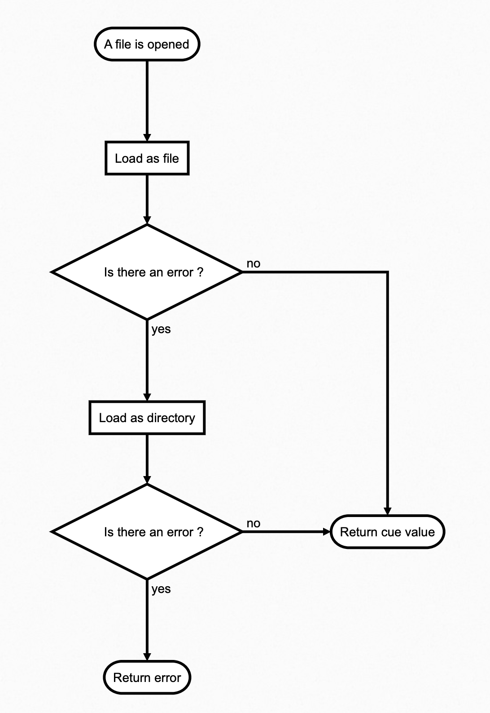

# How DLSP load CUE ?

## Theory

Even if DLSP work with raw CUE, he unleashes his capabilities when using with Dagger.

One big challenge of CUE is to know how load the current file. There are 2 ways:

- As a directory
- As a simple file

Same as Go package, you can write CUE in multiple files in the same directory and then merge everything on evaluation.
**BUT** with Dagger, you can also create multiples plans in a same directory that must be evaluated one by one.  
As an example, see our [docker tests](https://github.com/dagger/dagger/tree/main/pkg/universe.dagger.io/docker/test).

```
tree -P "*.cue" -I "testdata"
.
├── build.cue
├── dockerfile.cue
├── image.cue
└── run.cue
```

:bulb: A _plan_ is a file that contains `dagger.#Plan` definition. For more information,
see [official documentation](https://docs.dagger.io/1202/plan).

On the other side, DLSP must work when you want to develop new definitions that are not part of a `dagger.#Plan`, for
instance if you want to create your own [reusable action](https://docs.dagger.io/1239/making-reusable-package).

So we have a problem : how know how load the plan?

## Practise

First, it's not possible to just load the file itself because if there are imported definition in, we would not be able
to load the value, same for keys/definitions in other files of the directory. So it's mandatory to **load from user's
filesystem**.

Then it's straight forward, if there is something from an external file, trying to load plan as a file will fail.

So what we do is simple :



## :warning: Limitation

Some plans can work alone even if they supposed to be merged during usage.  
That should not affect usability of DLSP for now, but if it does, feel free to open an issue, so we can prioritize this
problem